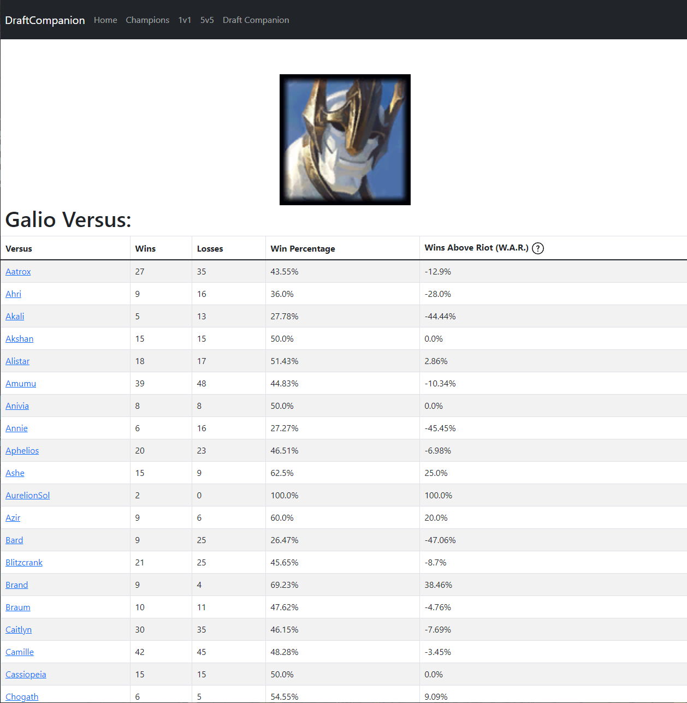

# DraftCompanion

**What is DraftCompanion?**
DraftCompanion is a reference web application with specialized tools to aid in strategy and team development for League of Legends players of all levels.

## Demo
A live working demo can be found here: https://draft-companion-340518.uc.r.appspot.com/

## Important Knowledge
### What is League of Legends?
League of Legends (LoL) was developed by [Riot Games](https://www.riotgames.com/en) in 2009. It is a part of the Multiplayer Online Battle Arena (MOBA) genre in which two teams of five players compete against each other to be the first team to destroy their enemy team's Nexus. The players each draft a unique champion to play as from a roster of 161 characters.
(For a more detailed description see [here](https://lol.fandom.com/wiki/New_To_League/Welcome))

### Vocabulary
(the links provided offer a more detailed description of these terms)
| Term | Definition |
| ---- | ---- |
| [Champion](https://lol.fandom.com/wiki/New_To_League/Gameplay) | Champions are the player-controlled units in League of Legends |
| [Draft](https://lol.fandom.com/wiki/New_To_League/Gameplay/Champ_Select) | Also referred to as ‘Champ Select’ or ‘Pick-Ban Phase’, the draft takes place before the game starts. During this time, teams take turns deciding which champions they want to have on their team (their “picks”) and which champions they don’t want the enemy team to have access to (their “bans”) |
| [Team Composition](https://lol.fandom.com/wiki/New_To_League/Meta/Team_Compositions) (or team comp) | Quite literally, team composition refers to the five champions that a team has chosen to play |
| [Lane](https://lol.fandom.com/wiki/New_To_League/Meta) | A lane refers to the area of the map where a player spends the majority of their time |
| [Lane Opponent](https://lol.fandom.com/wiki/New_To_League/Meta/Roles) | A players lane opponent refers to the champion on the enemy team that is assigned to the same lane as the player |

## Technologies Used
- Python 3.9.6
- Bootstrap 5.1.3
- Flask 2.0.2
- RiotWatcher 3.2
- Jinja2 3.0.3
- Pandas 1.3.3
- Numpy 1.23.3
- jQuery 1.7.1
- Google Cloud

## Why
The DraftCompanion web app has been a passion project of mine since November 2021. While watching a competitive League of Legends (LoL) tournament I was surprised to see teams using sophomoric documents and anecdotal information to inform their draft strategies. They were using a simple Google Sheets document and were typing champion names in and trying to come up with strategies using just their knowledge. Additionally, they were using reference sites to look up their opponents and see what champions they played the most to see if they could find any weaknesses to exploit. To me, it seemed like flipping back and forth between websites was a lot of unnecessary work and there had to be an easier way for them to achieve the same results. **I knew that there had to be an easier way.**

At that time, I was enrolled in artificial intelligence and software development classes at Purdue and I realized that I could apply the skills I was learning to build a tool that could make the drafting process easier for players.

## The Process
Even though I learned a lot in my classes at Purdue, the software development class I took only gave me a shallow look into the web development process. It was enough to give me ideas, but I wanted to know more. So, in my free time I began to slowly build the DraftCompanion website, researching and teaching myself the things I didn’t learn in class as I went along. Because I was learning more about the process as I went along, the quality of my work increased with each new feature I added. The clearest evidence of this is the difference in quality between the One v One Calculator and the Five v Five Team Composition Analyzer, with the former being a rather basic design and the latter more closely resembling the champion select screen from LoL. (see image below: [pro play draft](https://lol.fandom.com/wiki/New_To_League/Gameplay/Champ_Select#/media/File:New_to_League_2017_Picks_and_Bans.png) OR [normal champ select](https://squadstate.com/wp-content/uploads/2020/01/PIpfIv9-1024x576.jpg))

As the project continued to evolve, I decided I needed to take a step back and come up with a concrete plan so I could keep myself on track. So I broke the problem down into a format I could easily understand, and developed a research question and hypothesis.

- **Research Question:** Can past game data be used to predict the outcome of future competitive LoL matchups?

- **Hypothesis:** Collecting data from high elo players gives the closest representation of champions' strengths and weaknesses and formulates a prediction about the outcome of a match, with a measured level of confidence, prior to it commencing.

  

I knew that I needed to gather enough of the right data, from the right games, with enough champion matchups to offer strategic and predictive insights.

  

Key steps taken to minimize factors that might skew data:

- Gathered the data from a reliable source (Riot Games)

- Large enough set to represent a myriad of games situations (currently ~70k games)

- Focused on games played by the highest ranked players (minimized the impact of differences in player's skill sets)

- Captured over a specific time frame (minimized the impact of game evolution)

- Organized team data - only variable that cannot be accounted for is the benefit communication between players brings to organized teams

  
  
  

## How to use the DraftCompanion Web App

### [Home Page](https://draft-companion-340518.uc.r.appspot.com)

  

### [Champion Data Tables](https://draft-companion-340518.uc.r.appspot.com/champion_list)

The first two tools the DraftCompanion offers to its users are the ally and versus data tables. These tables represent the data that has been collected for each champion. The versus tables show the performance of a given champion when another champion is on the enemy team. The ally tables show the performance of a given champion when they have any other champion on their team. These tables give users the ability to see what pairings or matchups their champion excels at and where they might run into problems.

  

  
  

### [One v One Calculator](https://draft-companion-340518.uc.r.appspot.com/one_v_one)

The third tool offered by the DraftCompanion is the one v one calculator. This gives users a quick and easy way to see how one champion does when playing against another. Users will most likely use this tool when they want to see how the champion they chose matches up against their lane opponent.

  
  

  
  

### [Five v Five Team Composition Analyzer](https://draft-companion-340518.uc.r.appspot.com/five_v_five)

The fourth tool offered by the DraftCompanion is the five v five team composition analyzer. This gives users the ability to see how their team composition matches up against their opponents. The percentage shown next to the champion is their collective win rate against each of the champions on the enemy team. At the bottom of the page, the ‘Team Win Rate’ section shows which team has the edge over the other and currently serves as a loose indicator of who should win the game.

  
  

  
  

If the user wants to see more information about each champion's individual matchups, they can change over to the detailed view using the button at the top of the page, which provides a more in-depth look at how each champion has performed against the enemy team.

  
  

  

## Moving Forward

- (As of 10/12) Some of the more recent updates I have done on the backend have not made their way to the live site yet, but I plan on pushing those changes soon.

- The namesake for this website, the DraftCompanion, is currently the only tool I had planned from the beginning that has not shipped. The DraftCompanion tool will give users the ability to analyze their draft while it is happening and will give them suggestions on who they should pick or ban next to maximize their advantage over their opponent. The UI will look very similar to the Five v Five Calculator but will include the aforementioned suggestions in a window. After its initial launch I might give users the option to include the account names of players in the game so the DraftCompanion can give them suggestions tailored to their specific situation.

- Additions coming to existing features:

- Making the versus and ally tables sortable so they are easier to use and understand.

- Updating the UI for the Five v Five Team Composition Analyzer so that it resembles the champion select screens users would be more familiar with.

- Updating the UI for the One v One Calculator so that it more closely resembles the Five v Five Team Composition Analyzer.

- Adding something akin to the “I’m feeling lucky” buttons to the calculators, and possibly the homepage, that will populate the calculators with random champions or bring the user to a random champions data table.

- Adding a scrolling window on the homepage that displays noteworthy/unique stats about champions so people can find interesting information easily.
